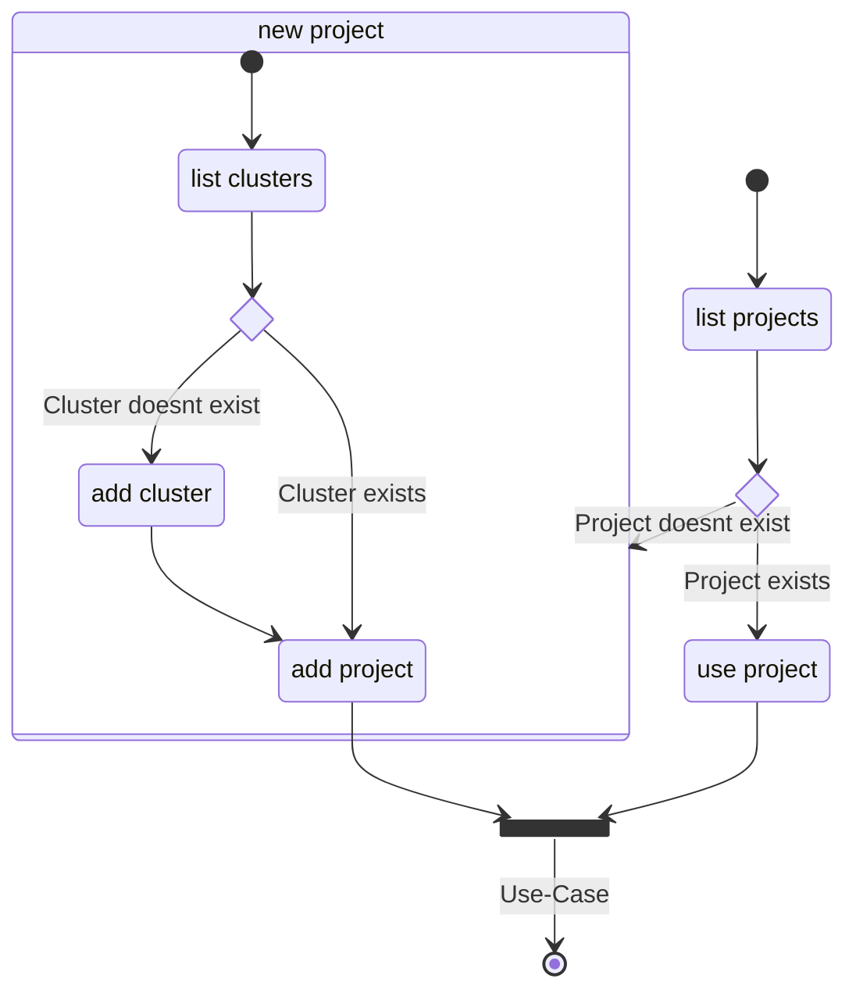

# K8s Binnacle

K8s Binnacle is a knowledge graph of the core Kubernetes components and mechanism.
Its objective is to aid developers with Kubernetes related tasks and be the foundation of advanced reasoning capabilities
to improve the security posture.
The backend database is [TypeDB](https://vaticle.com/typedb).

Binnacle connects to a specified kubernetes cluster and loads information about all its resources (accessible with the provided `kubectl` context).
These resources are then migrated to a knowledge base, which has implicit rules to infer additional knowledge and relations of the target Kubernetes cluster.

Supported capabilities:

- the usage secrets used by pods are modeled as explicit relations.
- capabilities provided via RBAC rules are related to one of the following subjects `ServiceAccount`, `Group` and `User`.

## Installation

Install all dependencies using the command `poetry install`

### Context

Binnacle is a services that's intended to be used by other applications. The environment will be analyzed by Binnacle beforehand.

## Build

### Skaffold

Before running `skaffold run` someone has to select the local aws ECR instance, where skaffold pushes the image.

## Deployment

Binnacle can run either run as a Python application directly or in a container.

Binnacle comes with a prepared `Dockerfile` and `docker-compose` file.

- to build the container run `docker build . -t binnacle`
- to run it call `docker-compose up`

## Usage

To use Binnacle the **target cluster** must be registered and then loaded into a **project**.

|                | CLI                                                | API                     |
| -------------- | -------------------------------------------------- | ----------------------- |
| List Clusters  | `kubectl config get-contexts`                      | GET /clusters           |
| Add Cluster    |                                                    | POST /clusters          |
| Delete Cluster |                                                    | DELETE /clusters/<name> |
| List Projects  |                                                    | GET /projects           |
| Add Project    | `binnacle populate`                                | PUT /projects           |
| Delete Project | `typedb console --comand="database delete <name>"` | DELETE /projects/<name> |

### Settings

---

## Use-Cases

Prerequisite: the database has been populated with the objects from the target cluster (see above).

_A description of use-cases will follow ..._

## 🏛️ Architecture

Either entrypoint interacts with the `Service` component, which manages any interaction with Binnacle.

The domain knowledge is modeled in the `Domain Model` component, which includes the supported entities and any rules for the inference.

The information is persisted in a dedicated repository _(currently only TypeDB is supported!)_, which is abstracted in the `Adapters` component.

