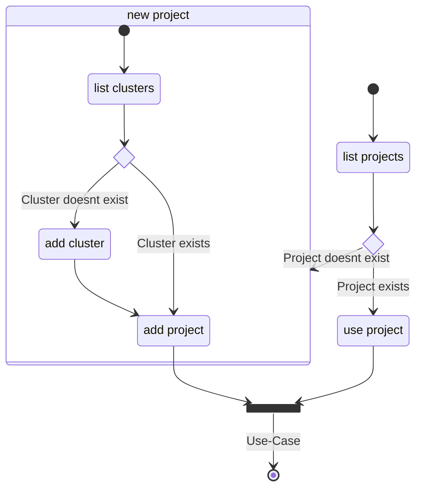

# K8s Binnacle

K8s Binnacle is a knowledge graph of the core Kubernetes components and mechanism.
Its objective is to aid developers with Kubernetes related tasks and be the foundation of advanced reasoning capabilities
to improve the security posture.
The backend database is [TypeDB](https://vaticle.com/typedb).

Binnacle connects to a specified kubernetes cluster and loads information about all its resources (accessible with the provided `kubectl` context).
These resources are then migrated to a knowledge base, which has implicit rules to infer additional knowledge and relations of the target Kubernetes cluster.

Once loaded, the cluster can be analyzed either using regular TypeQL queries or by building upon Binnacle to solve more sophisticated problems.

## Requirements

Currently, Binnacle loads the data directly from a Kubernetes cluster targeted by [kubectl](https://kubernetes.io/docs/reference/kubectl/).
To access the necessary data RBAC read permissions like `get` and/or `list` are required for most of the resources.
For more sophisticated analysis, this also includes `Nodes`, `Secrets`, `NetworkPolicies`, etc..

## Installation

Install all dependencies using the command `poetry install`.

### Context

Binnacle is a services that's intended to be used by other applications. The environment will be analyzed by Binnacle beforehand.

## Build

### Skaffold

Before running `skaffold run` someone has to select the local aws ECR instance, where skaffold pushes the image.

## Deployment

Binnacle can run either run as a Python application directly or in a container.

Binnacle comes with a prepared `Dockerfile` and `docker-compose` file.

- to build the container run `docker build . -t binnacle`
- to run it call `docker-compose up`

## Usage

To use Binnacle the **target cluster** must be registered and then loaded into a **project**.

|                | CLI                                                | API                     |
| -------------- | -------------------------------------------------- | ----------------------- |
| List Clusters  | `kubectl config get-contexts`                      | GET /clusters           |
| Add Cluster    |                                                    | POST /clusters          |
| Delete Cluster |                                                    | DELETE /clusters/<name> |
| List Projects  |                                                    | GET /projects           |
| Add Project    | `binnacle populate`                                | PUT /projects           |
| Delete Project | `typedb console --comand="database delete <name>"` | DELETE /projects/<name> |

## 🫶 Contribution

Want to contribute? Awesome!    
We are interested to see what problems you (want to) solve with a Kubernetes knowledge graph.
All types of contributions are welcome: ideas, fixes, bug reports, and feedback of any kind.

- See the contributing guide [here](./doc/CONTRIBUTING.md).
- Check out the [Development Guide](./docs/DEVELOPER-GUIDE.md) for more information.
- By contributing you agree to abide by the [Code of Conduct](./docs/CODE_OF_CONDUCT.md).
- If you're still unsure, feel free to reach out to us directly!

